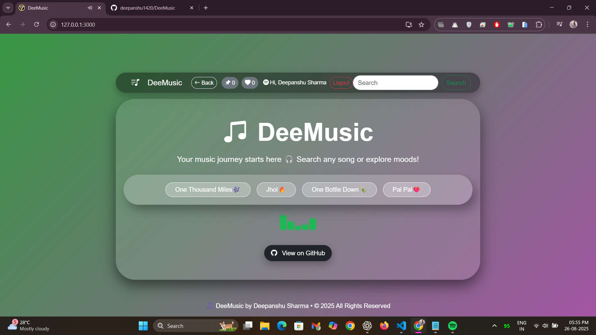
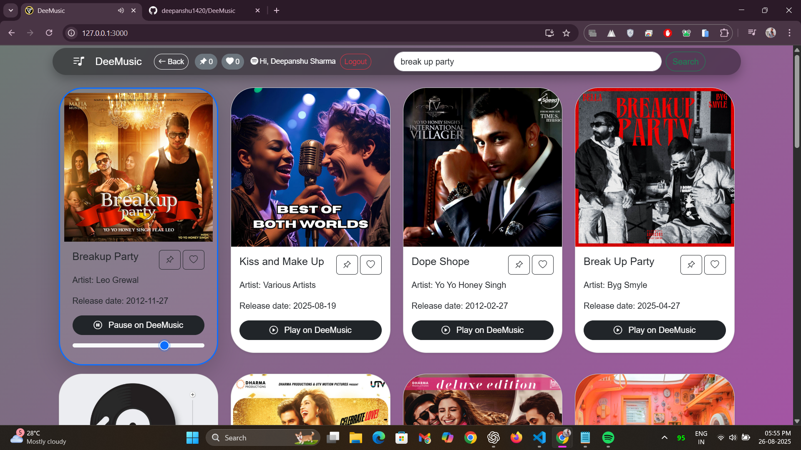
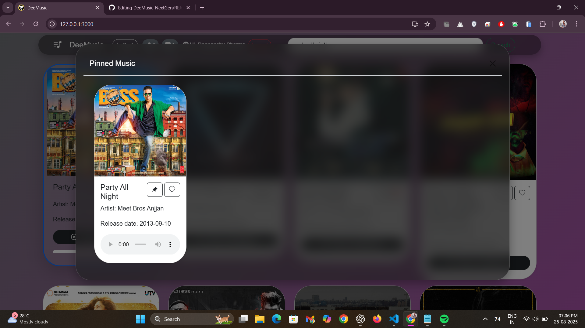
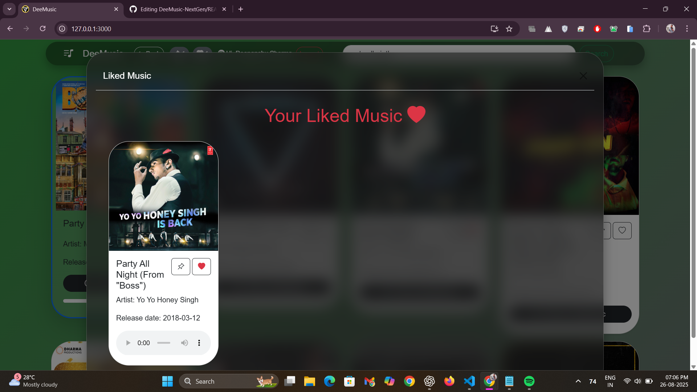
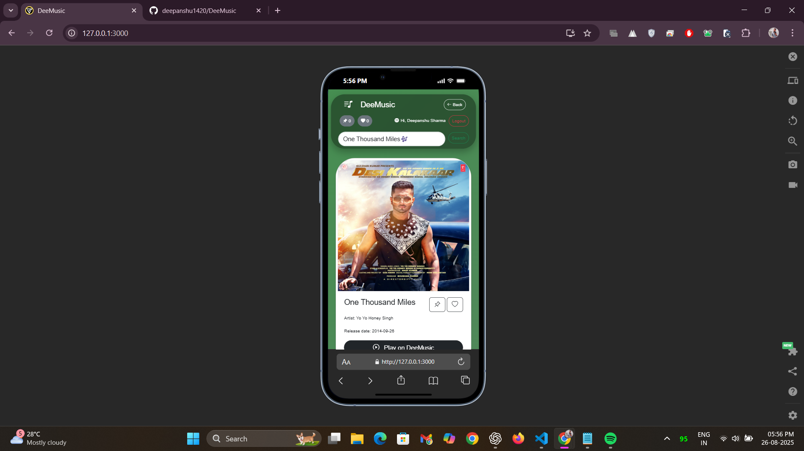
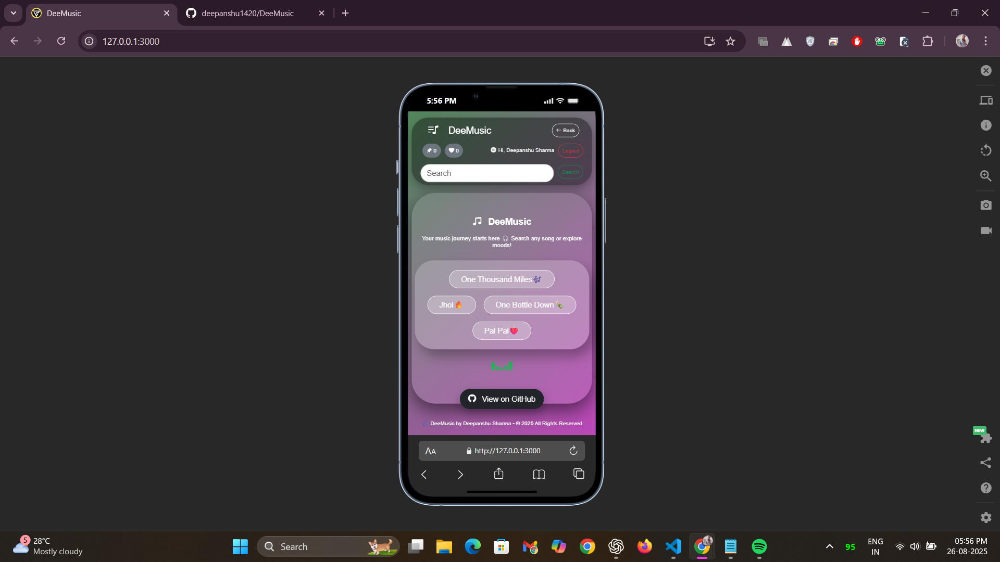

# 🎵 DeeMusic-NextGen

[](https://reactjs.org/) [](https://vitejs.dev/) [](https://tailwindcss.com/) [](https://axios-http.com/) [](https://getbootstrap.com/) [](https://reactrouter.com/) [](https://developer.spotify.com/) [](LICENSE) [](https://github.com/) [](https://www.spotify.com/premium/)

**DeeMusic-NextGen is a modern, web-based music application that lets users search, explore, and play music directly in their PC browser using their Spotify Premium account.**

**Live Demo:** [Click here to try DeeMusic-NextGen](https://deemusic-online.netlify.app/) *(Songs playback runs on browser only)*

---

## 🌟 Overview

Dive into music like never before with DeeMusic-NextGen. Effortlessly browse songs, playlists, and moods through a sleek, responsive interface, and enjoy real-time playback powered by the Spotify Web Playback SDK, all seamlessly managed with React Context and Axios for a smooth, interactive experience. 

**Important Notes:**  
- Music playback works **only on PC/Desktop browsers**.  
- Users must login using a **Spotify Premium account**.  

---

## ⚡ Features

- **Spotify Premium Login** – Securely login with your Spotify Premium account.  
- **Search Songs & Artists** – Quickly find your favorite tracks.  
- **Play Music in Browser** – Music can be played on PC browsers (mobile playback disabled).  
- **Responsive UI** – Works on both desktop and mobile, with music playback available on desktop browsers only.  
- **Interactive Controls** – Play, pause, favorite, pin, like songs, and see current track info. 
- **Mood & Playlist Exploration** – Browse songs based on moods or trending playlists.  

---

## ✨ New Features & Highlights

- **Pin & Like Songs:** Users can pin or like their favorite tracks and see how many songs are pinned or liked.  
- **Glassmorphism Design:** A new modern UI inspired by Apple Music and iOS 18.6 beta.  
- **Smooth Animations:** Transitions and interactions throughout the app are now smoother and more engaging.  

---

## ✅ Advantages

- Modern and clean UI using Tailwind CSS and Bootstrap.  
- Smooth real-time music playback on PC browsers.  
- Fully responsive and interactive music application.  
- Easy to maintain and extend React-based project.  
- Clear separation of components and state management using React Context.  

---

## 📸 Screenshots

### Home Screen


### Song Cards


### Pinned Feature


### Liked Feature


### Search Results


### Mobile View (Playback Disabled)



---

## 🛠 Tech Stack

- **Framework:** React v18, React Hooks (useState, useEffect, useContext, useRef), React Context API  
- **Styling:** Tailwind CSS v3.3, Bootstrap, CSS (Glassmorphism & custom styling)  
- **API & Data Fetching:** Axios v1.4, Spotify Web API, Spotify Web Playback SDK  
- **Routing:** React Router (react-router-dom)  
- **Build Tool:** Vite v4.3  
- **Language:** JavaScript ES6+

---

## ⚡ Installation

```bash
# 1. Clone the repository
git clone <your-repo-link>

# 2. Navigate to the project folder
cd DeeMusic-NextGen

# 3. Install dependencies
npm install

# 4. Start the development server
npm start 
