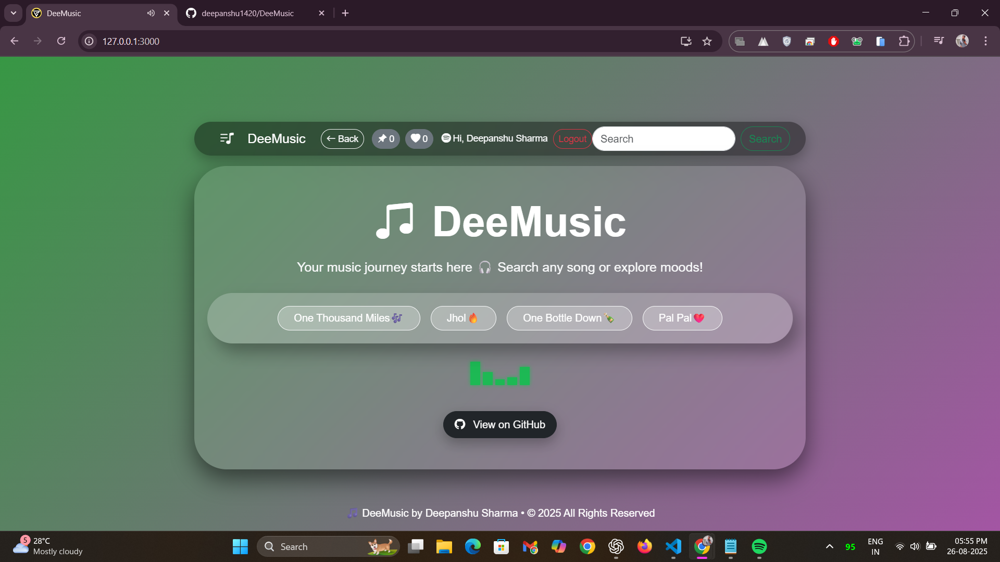
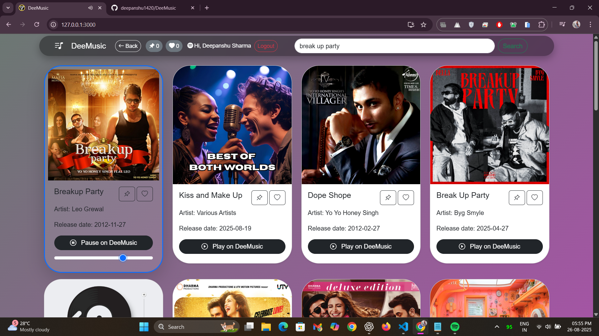
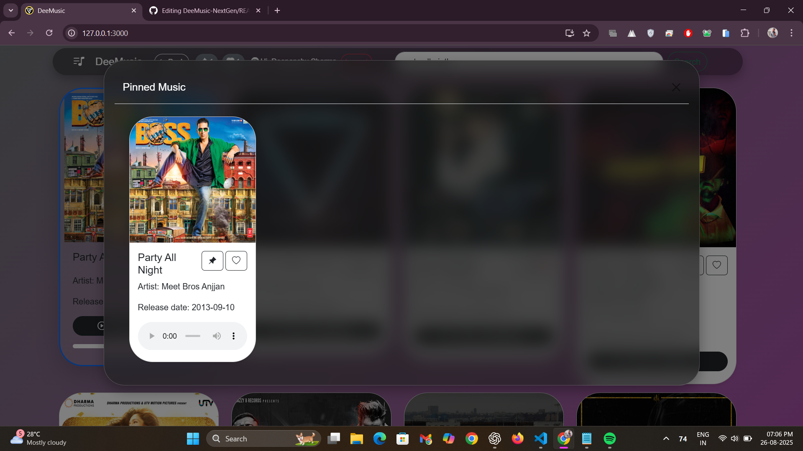
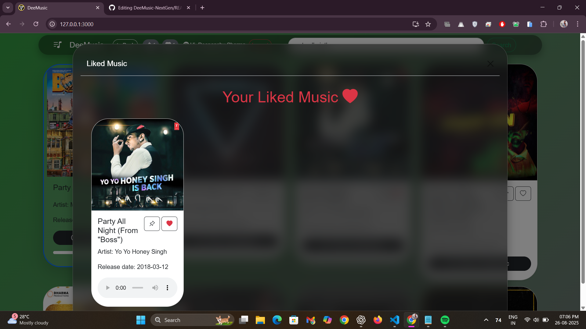
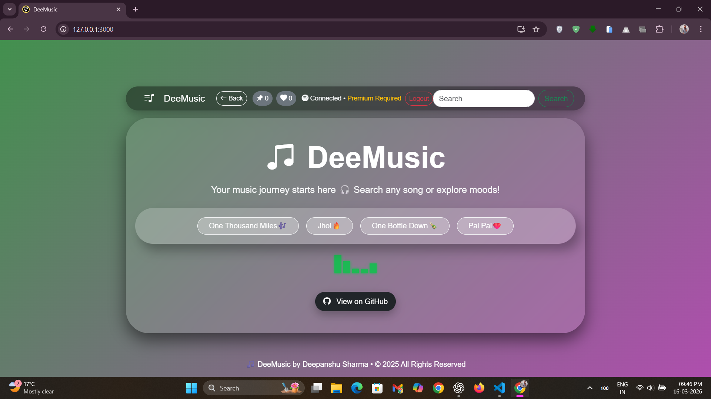
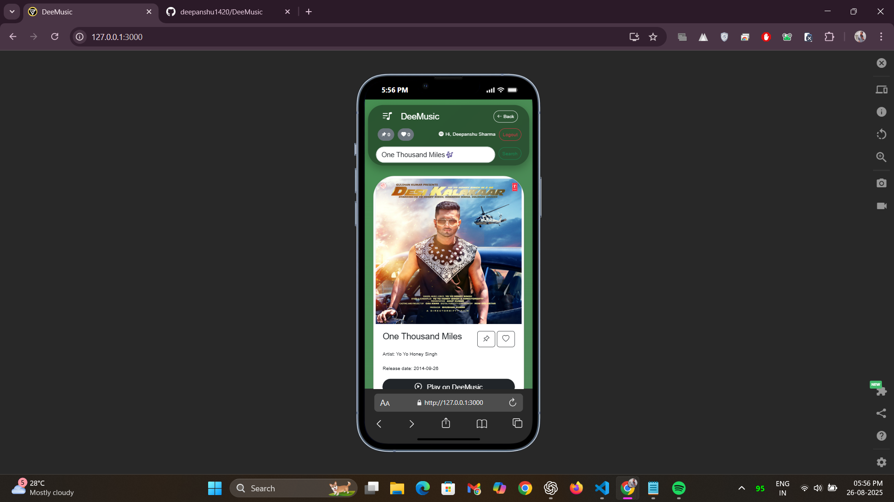
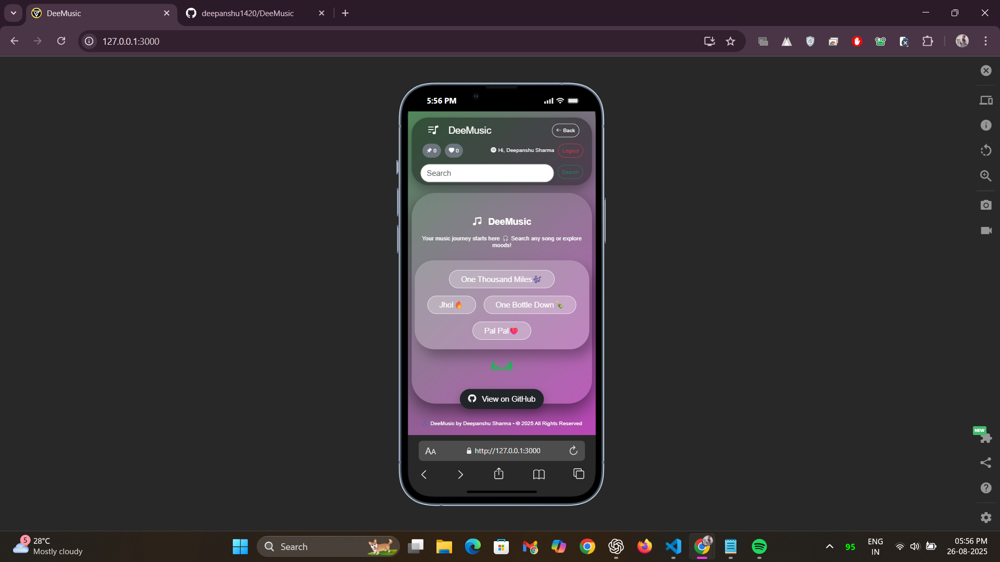

# 🎵 DeeMusic-NextGen

[](https://reactjs.org/) [](https://vitejs.dev/) [](https://tailwindcss.com/) [](https://axios-http.com/) [](https://getbootstrap.com/) [](https://reactrouter.com/) [](https://developer.mozilla.org/docs/Web/JavaScript) [](https://developer.spotify.com/) [](LICENSE) [](https://deemusic-online.netlify.app/) [](https://www.spotify.com/premium/)

**DeeMusic-NextGen is a modern, web-based music application that lets users search, explore and play music directly in their browser using their Spotify Premium account.**

**🌐 Live Demo :** [Listen DeeMusic!](https://deemusic-online.netlify.app/)

## 🌟 Overview

Dive into music like never before with DeeMusic-NextGen, effortlessly browse songs, playlists and moods through a sleek, responsive interface and enjoy real-time playback powered by the Spotify Web Playback SDK, all seamlessly managed with React Context and Axios for a smooth, interactive experience. 

**Important Notes:**  
- 🛡️ Users must login using a `Spotify Premium account`.  
- 🎵 Music playback works on both desktop and mobile browsers.  

## ⚡ Spotlights

- **🔐 Spotify Premium Login** - Securely login with your Spotify Premium account.  
- **🔎 Search Songs & Artists** - Quickly find your favorite tracks.  
- **🎵 Play Music in Browser** - Music can be played on both desktop and mobile browsers.  
- **📱 Responsive UI** - Works on all device sizes.  
- **🎛️ Interactive Controls** - Play, pause, pin, like favorite songs and see current track info. 
- **🌈 Mood & Playlist Exploration** - Browse songs based on moods or trending playlists.  

## ✨ New Features & Highlights

- **📌 Pin & Like Songs:** Users can pin or like their favorite tracks and see how many songs are pinned or liked.  
- **🪟 Glassmorphism Design:** A modern UI inspired by Apple Music and iOS 26.  
- **✨ Smooth Animations:** Transitions and interactions throughout the app are now smoother and more engaging.  

## ✅ Advantages

- 🎨 Modern and clean UI using Tailwind CSS and Bootstrap.  
- 🎧 Smooth real-time music playback on desktop and mobile.  
- 📱 Fully responsive and interactive music application.  
- 🛠️ Easy to maintain and extend React-based project.  
- 🧠 Clear separation of components and state management using React Context.  

## 📸 Screenshots / Demo

### 🏠 Home Screen

*Dive into a sleek home hub where every track is just one click away.*

### 🎵 Song Cards

*Scroll through dynamic song cards that spark instant play with style.*

### 📌 Pinned Feature

*Pin your top tracks and bring them to the spotlight whenever you want.*  

### ❤️ Liked Feature

*Hit like and watch your personal playlist build itself in real-time.*

### 🔒 Premium Required

*Playback and search features require a `Spotify Premium account` under Spotify’s updated guidelines.*

### 🔍 Search Results

*Type, search and discover - your favorite music shows up instantly.*

### 📱 Mobile View

*Experience the same powerful features on-the-go with a smooth mobile view.*  

## 🛠 Tech Stack Used

- **⚛️ Framework:** React v18, React Hooks (useState, useEffect, useContext, useRef), React Context API  
- **🎨 Styling:** Tailwind CSS v3.3, Bootstrap, CSS (Glassmorphism & custom styling)  
- **🔗 API & Data Fetching:** Axios v1.4, Spotify Web API, Spotify Web Playback SDK  
- **🧭 Routing:** React Router (react-router-dom)  
- **⚡ Build Tool:** Vite v4.3  
- **🟨 Language:** JavaScript ES6+  

## ⚙️ Setup and Installation

Follow these steps to run the project locally on your machine:

### 1️⃣ Clone the Repository

```bash
git clone https://github.com/deepanshu1420/DeeMusic-NextGen.git
```

### 2️⃣ Navigate to the project folder

```bash
cd DeeMusic-NextGen
```

### 3️⃣ Install Dependencies

Make sure you have **Node.js** installed, then run:

```bash
npm install
```

### 4️⃣ Start the development server

```bash
npm start
```

The app should now be running locally 🎵  

